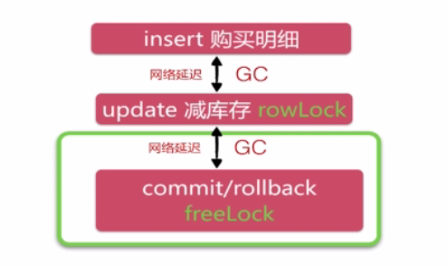

# seckill
秒杀系统学习和实现

# 目标
1. 巩固SSM框架整合的知识
2. 学习优化的入门知识

# 使用技术
MySQL:
 - 手写SQL语句创建表
 - 事务和行级锁的应用

MyBatis：
 - DAO层，Mapper动态代理方式实现数据库访问(只需要编写接口和xml即可，不需要编写接口的实现类
 - 和Spring框架整合

Spring：
 - IOC功能，整合Serive和依赖注入
 - 声明式事务的使用

SpringMVC：
 - Restful URL的使用
 - Controlller的使用技巧

BootStrap：
 - UI快速实现

JQuery：
 - Ajax请求和页面逻辑编写

Redis：
 - 缓存，用于优化高并发

# 实现功能
## 业务分析
**商家** -> (添加/调整) -> **库存** (秒杀/预售) -> **用户**
**商家** <- (发货/核账) <- **库存** (付款/退货) <- **用户**
秒杀实际上是针对库存做的操作：
1. 减库存
2. 记录用户的购买明细

 - 谁购买成功了
 - 购买成功的时间
 - 付款/发货信息

使用MySQL内置事务实现秒杀的步骤：
- 开启事务
- 更新商品库存信息
- 添加用户的购买明细，使用商品ID+用户身份信息（电话号码）作为唯一标识

## 前端流程设计

## URL设计


## 难点分析：
在用户A秒杀X商品的时候，会锁住X商品所在行，其他所有用户的等待直到这个行级锁释放才可以进行秒杀行为

# 项目编写步骤
采用的方式是从后往前写

## DAO层

### 使用maven命令生成web项目
`mvn archetype:generate -DgroupId=org.seckill -DartifactId=seckill -Dpackage=org.seckill -Dversion=1.0-SNAPSHOT -DarchetypeArtifactId=maven-archetype-webapp`
### 编写数据库实体类
org.seckill.entity包
**Class Seckill**
 - seckillId：商品ID
 - name：商品名称
 - number：商品库存数量
 - startTime：开始秒杀时间
 - endTime：结束秒杀时间
 - createTime：商品创建时间

**Class SuccessKilled**
 - seckillId：秒杀商品ID
 - userPhone：用户手机号
 - state：状态标识:-1:无效 0:成功 1:已付款 2:已发货
 - createTime：秒杀下单时间

### DAO接口
org.seckill.dao
**SeckillDao**
 - `int reduceNumber(@Param("seckillId") long seckillId, @Param("killTime") Date killTime);`：减库存操作
 - `Seckill queryById(long seckillId);`：根据id查询秒杀的商品信息
 - `List<Seckill> queryAll(@Param("offset") int offset,@Param("limit") int limit);`：分页查询秒杀商品列表

**SuccessKilledDao**
 - `int insertSuccessKilled(long seckillId,long userPhone);`：插入购买明细,使用联合主键过滤重复
 - `SuccessKilled queryByIdWithSeckill(long seckillId,long userPhone);`：根据秒杀商品的id查询明细SuccessKilled对象(该对象携带了Seckill秒杀产品对象)

### Mybatis的配置文件
mybatis-config.xml
```
<?xml version="1.0" encoding="UTF-8" ?>
<!DOCTYPE configuration
        PUBLIC "-//mybatis.org//DTD Config 3.0//EN"
        "http://mybatis.org/dtd/mybatis-3-config.dtd">
<configuration>
    <!--配置全局属性-->
    <settings>
        <!--使用jdbc的getGeneratekeys获取自增主键值-->
        <setting name="useGeneratedKeys" value="true"/>
        <!--使用列别名替换列名　　默认值为true
        select name as title(实体中的属性名是title) form table;
        开启后mybatis会自动帮我们把表中name的值赋到对应实体的title属性中
        -->
        <setting name="useColumnLabel" value="true"/>

        <!--开启驼峰命名转换Table:create_time到 Entity(createTime)-->
        <setting name="mapUnderscoreToCamelCase" value="true"/>
    </settings>

</configuration>
```
### Mapper文件
配置2个mapper文件，并编写SQL语句
SeckillDao.xml
SuccessKilledDao.xml

### spring-dao.xml

```
<?xml version="1.0" encoding="UTF-8"?>
<beans xmlns="http://www.springframework.org/schema/beans"
       xmlns:xsi="http://www.w3.org/2001/XMLSchema-instance"
       xmlns:context="http://www.springframework.org/schema/context"
       xsi:schemaLocation="http://www.springframework.org/schema/beans
        http://www.springframework.org/schema/beans/spring-beans.xsd
        http://www.springframework.org/schema/context http://www.springframework.org/schema/context/spring-context.xsd">

    <!--配置整合mybatis过程
    1.配置数据库相关参数-->
    <context:property-placeholder location="classpath:jdbc.properties"/>

    <!--2.数据库连接池-->
    <bean id="dataSource" class="com.mchange.v2.c3p0.ComboPooledDataSource">
        <!--配置连接池属性-->
        <property name="driverClass" value="${jdbc.driver}" />

        <!-- 基本属性 url、user、password -->
        <property name="jdbcUrl" value="${jdbc.url}" />
        <property name="user" value="${jdbc.username}" />
        <property name="password" value="${jdbc.password}" />

        <!--c3p0私有属性-->
        <property name="maxPoolSize" value="30"/>
        <property name="minPoolSize" value="10"/>
        <!--关闭连接后不自动commit-->
        <property name="autoCommitOnClose" value="false"/>

        <!--获取连接超时时间-->
        <property name="checkoutTimeout" value="1000"/>
        <!--当获取连接失败重试次数-->
        <property name="acquireRetryAttempts" value="2"/>
    </bean>

    <!--约定大于配置-->
    <!--３.配置SqlSessionFactory对象-->
    <bean id="sqlSessionFactory" class="org.mybatis.spring.SqlSessionFactoryBean">
        <!--往下才是mybatis和spring真正整合的配置-->
        <!--注入数据库连接池-->
        <property name="dataSource" ref="dataSource"/>
        <!--配置mybatis全局配置文件:mybatis-config.xml-->
        <property name="configLocation" value="classpath:mybatis-config.xml"/>
        <!--扫描entity包,使用别名,多个用;隔开-->
        <property name="typeAliasesPackage" value="org.seckill.entity"/>
        <!--扫描sql配置文件:mapper需要的xml文件-->
        <property name="mapperLocations" value="classpath:mapper/*.xml"/>
    </bean>

    <!--４:配置扫描Dao接口包,动态实现DAO接口,注入到spring容器-->
    <bean class="org.mybatis.spring.mapper.MapperScannerConfigurer">
        <!--注入SqlSessionFactory-->
        <property name="sqlSessionFactoryBeanName" value="sqlSessionFactory"/>
        <!-- 给出需要扫描的Dao接口-->
        <property name="basePackage" value="org.seckill.dao"/>
    </bean>

    <!--redisDao-->
    <bean id="redisDao" class="org.seckill.dao.cache.RedisDao">
        <constructor-arg index="0" value="localhost"/>
        <constructor-arg index="1" value="6379"/>
    </bean>
</beans>
```
## Service层
### 设计秒杀service接口
org.seckill.service包
 - 查询全部的秒杀记录：`List<Seckill> getSeckillList();`
 - 查询单个秒杀记录：`Seckill getById(long seckillId);`
 - 在秒杀开启时输出秒杀接口的地址，否则输出系统时间和秒杀时间：`Exposer exportSeckillUrl(long seckillId);`
 - 执行秒杀操作，有可能失败，有可能成功，所以要抛出我们允许的异常：
   ```
	SeckillExecution executeSeckill(long seckillId,long userPhone,String md5)
            throws SeckillException,RepeatKillException,SeckillCloseException;
   ```
## 设计和web层传递数据的实体
org.seckill.dto包
### 暴露秒杀地址
**class Exposer**
 - 是否开启秒杀
 - 加密措施：md5和商品ID结合
 - 系统当前时间(毫秒)
 - 秒杀的开启时间
 - 秒杀的结束时间

### 封装执行秒杀后的结果:是否秒杀成功
**class SeckillExecution**
 - 商品ID
 - 秒杀执行结果的状态 
 - 状态的明文标识
 - 当秒杀成功时，需要传递秒杀成功的对象回去

 - 2个构造方法
  - 秒杀成功返回所有信息(秒杀的商品id、秒杀成功状态、成功信息、用户明细)`public SeckillExecution(long seckillId, SeckillStatEnum statEnum, SuccessKilled successKilled)`
  - 秒杀失败`public SeckillExecution(long seckillId, SeckillStatEnum statEnum)`

 - SeckillStatEnum枚举类：用于限定秒杀执行结果的状态和状态的明文标识
	 - SUCCESS(1,"秒杀成功"),
     - END(0,"秒杀结束"),
     - REPEAT_KILL(-1,"重复秒杀"),
     - INNER_ERROR(-2,"系统异常"),
     - DATE_REWRITE(-3,"数据篡改");
### 秒杀操作的3个异常类
**class SeckillExecution**
```
package org.seckill.exception;

/**
 * 秒杀相关的所有业务异常
 */
public class SeckillException extends RuntimeException {
    public SeckillException(String message) {
        super(message);
    }

    public SeckillException(String message, Throwable cause) {
        super(message, cause);
    }
}

```
**class RepeatKillException**
```
package org.seckill.exception;

/**
 * 重复秒杀异常，是一个运行期异常，不需要我们手动try catch
 * Mysql只支持运行期异常的回滚操作
 */
public class RepeatKillException extends SeckillException {

    public RepeatKillException(String message) {
        super(message);
    }

    public RepeatKillException(String message, Throwable cause) {
        super(message, cause);
    }
}
```
**class SeckillCloseException**
```
package org.seckill.exception;

/**
 * 秒杀关闭异常，当秒杀结束时用户还要进行秒杀就会出现这个异常
 */
public class SeckillCloseException extends SeckillException{
    public SeckillCloseException(String message) {
        super(message);
    }

    public SeckillCloseException(String message, Throwable cause) {
        super(message, cause);
    }
}
```
### 秒杀service的实现类
org.seckill.service.impl
**class SeckillServiceImpl**
主要功能
 - 日志记录：private Logger logger = LoggerFactory.getLogger(this.getClass());
 - md5

	```
	//加入一个混淆字符串(秒杀接口)的salt，为了避免用户猜出我们的md5值，值任意给，越复杂越好
    private final String salt = "dadadafdafaUJM(O0";
	private String getMD5(long seckillId) {
        String base = seckillId + "/" + salt;
        String md5 = DigestUtils.md5DigestAsHex(base.getBytes());
        return md5;
    }

	```
 - 其他SeckillService接口中的方法

### 配置spring-service.xml
```
<?xml version="1.0" encoding="UTF-8"?>
<beans xmlns="http://www.springframework.org/schema/beans"
       xmlns:xsi="http://www.w3.org/2001/XMLSchema-instance"
       xmlns:context="http://www.springframework.org/schema/context" xmlns:tx="http://www.springframework.org/schema/tx"
       xsi:schemaLocation="http://www.springframework.org/schema/beans
        http://www.springframework.org/schema/beans/spring-beans.xsd
        http://www.springframework.org/schema/context http://www.springframework.org/schema/context/spring-context.xsd http://www.springframework.org/schema/tx http://www.springframework.org/schema/tx/spring-tx.xsd">

    <!--扫描service包下所有使用注解的类型-->
    <context:component-scan base-package="org.seckill.service"/>

    <!--配置事务管理器-->
    <bean id="transactionManager" class="org.springframework.jdbc.datasource.DataSourceTransactionManager">
        <!--注入数据库连接池-->
        <property name="dataSource" ref="dataSource"/>

    </bean>

    <!--配置基于注解的声明式事务
    默认使用注解来管理事务行为-->
    <tx:annotation-driven transaction-manager="transactionManager"/>


</beans>
```
##web层
### 配置web.xml，引入springMVC的DispatcherServlet
```
<web-app xmlns="http://java.sun.com/xml/ns/javaee"
         xmlns:xsi="http://www.w3.org/2001/XMLSchema-instance"
         xsi:schemaLocation="http://java.sun.com/xml/ns/javaee
                      http://java.sun.com/xml/ns/javaee/web-app_3_0.xsd"
         version="3.0"
         metadata-complete="true">
<!--用maven创建的web-app需要修改servlet的版本为3.1-->
<!--配置DispatcherServlet-->
    <servlet>
        <servlet-name>seckill-dispatcher</servlet-name>
        <servlet-class>org.springframework.web.servlet.DispatcherServlet</servlet-class>
        <!--
            配置SpringMVC 需要配置的文件
            spring-dao.xml，spring-service.xml,spring-web.xml
            Mybites -> spring -> springMvc
        -->
        <init-param>
            <param-name>contextConfigLocation</param-name>
            <param-value>classpath:spring/spring-*.xml</param-value>
        </init-param>
    </servlet>
    <servlet-mapping>
        <servlet-name>seckill-dispatcher</servlet-name>
        <!--默认匹配所有请求-->
        <url-pattern>/</url-pattern>
    </servlet-mapping>
</web-app>
```
### spring整合，spring-web.xml
```
<?xml version="1.0" encoding="UTF-8"?>
<beans xmlns="http://www.springframework.org/schema/beans"
       xmlns:xsi="http://www.w3.org/2001/XMLSchema-instance"
       xmlns:context="http://www.springframework.org/schema/context"
       xmlns:mvc="http://www.springframework.org/schema/mvc"
       xsi:schemaLocation="http://www.springframework.org/schema/beans
        http://www.springframework.org/schema/beans/spring-beans.xsd
        http://www.springframework.org/schema/context
        http://www.springframework.org/schema/context/spring-context.xsd
        http://www.springframework.org/schema/mvc
        http://www.springframework.org/schema/mvc/spring-mvc.xsd">

    <!--配置spring mvc-->
    <!--1,开启springmvc注解模式
    a.自动注册DefaultAnnotationHandlerMapping,AnnotationMethodHandlerAdapter
    b.默认提供一系列的功能:数据绑定，数字和日期的format@NumberFormat,@DateTimeFormat
    c:xml,json的默认读写支持-->
    <mvc:annotation-driven/>

    <!--2.静态资源默认servlet配置-->
    <!--
        1).加入对静态资源处理：js,gif,png
        2).允许使用 "/" 做整体映射
    -->
    <mvc:default-servlet-handler/>

    <!--3：配置JSP 显示ViewResolver-->
    <bean class="org.springframework.web.servlet.view.InternalResourceViewResolver">
        <property name="viewClass" value="org.springframework.web.servlet.view.JstlView"/>
        <property name="prefix" value="/WEB-INF/jsp/"/>
        <property name="suffix" value=".jsp"/>
    </bean>

    <!--4:扫描web相关的controller-->
    <context:component-scan base-package="org.seckill.web"/>
</beans>
```
### Controller开发
**class SeckillController**

 - 实现seckillService.getSeckillList()方法,访问商品列表页
 ```
	@RequestMapping(value = "/list",method = RequestMethod.GET)
    public String list(Model model)
    {
        //list.jsp+mode=ModelAndView
        //获取列表页
        List<Seckill> list=seckillService.getSeckillList();
        model.addAttribute("list",list);
        return "list";
    }
 ``` 

 - 实现seckillService.getById(seckillId)方法，访问商品详情页
 ```
 @RequestMapping(value = "/{seckillId}/detail",method = RequestMethod.GET)
    public String detail(@PathVariable("seckillId") Long seckillId, Model model)
    {
        if (seckillId == null)
        {
            return "redirect:/seckill/list";
        }

        Seckill seckill=seckillService.getById(seckillId);
        if (seckill==null)
        {
            return "forward:/seckill/list";
        }

        model.addAttribute("seckill",seckill);

        return "detail";
    }
 ```

 - 实现seckillService.exportSeckillUrl(seckillId)方法，返回封装了秒杀地址的SeckillResult<Exposer>对象
 ```
 //ajax ,json暴露秒杀接口的方法
    @RequestMapping(value = "/{seckillId}/exposer",
                    method = RequestMethod.GET,
                    produces = {"application/json;charset=UTF-8"})
    @ResponseBody
    public SeckillResult<Exposer> exposer(@PathVariable("seckillId") Long seckillId)
    {
        SeckillResult<Exposer> result;
        try{
            Exposer exposer=seckillService.exportSeckillUrl(seckillId);
            result=new SeckillResult<Exposer>(true,exposer);
        }catch (Exception e)
        {
            e.printStackTrace();
            result=new SeckillResult<Exposer>(false,e.getMessage());
        }

        return result;
    }
 ```
 	- class SeckillResult<T> 实现，org.seckill.dto包
	 	- private boolean success;：请求是否成功
    	- private T data;：封装了秒杀地址的对象
    	- private String error;：错误信息

 - 实现seckillService.executeSeckill方法
 ```
 @RequestMapping(value = "/{seckillId}/{md5}/execution",
            method = RequestMethod.POST,
            produces = {"application/json;charset=UTF-8"})
    @ResponseBody
    public SeckillResult<SeckillExecution> execute(@PathVariable("seckillId") Long seckillId,
                                                   @PathVariable("md5") String md5,
                                                   @CookieValue(value = "userPhone",required = false) Long userPhone)
    {
        if (userPhone==null)
        {
            return new SeckillResult<SeckillExecution>(false,"未注册");
        }
        SeckillResult<SeckillExecution> result;

        try {
            SeckillExecution execution = seckillService.executeSeckill(seckillId, userPhone, md5);
            return new SeckillResult<SeckillExecution>(true, execution);
        }catch (RepeatKillException e1)
        {
            SeckillExecution execution=new SeckillExecution(seckillId, SeckillStatEnum.REPEAT_KILL);
            return new SeckillResult<SeckillExecution>(true,execution);
        }catch (SeckillCloseException e2)
        {
            SeckillExecution execution=new SeckillExecution(seckillId, SeckillStatEnum.END);
            return new SeckillResult<SeckillExecution>(true,execution);
        }
        catch (Exception e)
        {
            SeckillExecution execution=new SeckillExecution(seckillId, SeckillStatEnum.INNER_ERROR);
            return new SeckillResult<SeckillExecution>(true,execution);
        }

    }
 ```
 - 获取系统时间的方法

 ```
 //获取系统时间
    @RequestMapping(value = "/time/now",method = RequestMethod.GET)
    @ResponseBody
    public SeckillResult<Long> time()
    {
        Date now=new Date();
        return new SeckillResult<Long>(true,now.getTime());
    }
 ```

## 前端页面编写
此处省略，不做重点
 - webapp
	 - resource
		 - script
			 - seckill.js
	 - WEB-INF
		 - jsp
			 - common
				 - head.jsp
				 - tag.jsp
			 - detail.jsp
			 - list.jsp

## 几个注意点
 - web.xml中默认采用是servlet2.3，修改成3.0
 - pom.xml中添加依赖jar包信息
	 - 1. 日志：slf4j+logback
	 - 2. 数据库：mysql驱动+C3P0
	 - 3. DAO层：
		 - MyBatis
		 - MyBatis和Spring整合包
	 - 4. Servlet：
		 - 标签库：tablibs和jstl
		 - jackson
		 - javax.servlet
	 - 5. Spring
		 - core/beans/context
		 - jdbc:spring-jdbc
		 - 事务：spring-tx

	 - 6. SpringMVC
		 - spring-web
		 - spring-webmvc
	 - 7. Junit
		 - junit4
		 - spring-test

以上就完成了基本的秒杀逻辑代码编写
下面是重点，如何优化？
# 优化
## 高并发发生在哪里?

红色部分都是会发生高并发问题的地方
### 详情页的优化
**为什么需要单独获取系统时间？**
这是为了我们的秒杀系统的优化做铺垫。比如在秒杀还未开始的时候，用户大量刷新秒杀商品详情页面是很正常的情况，这时候秒杀还未开始，大量的请求发送到服务器会造成不必要的负担。

我们将这个详情页放置到CDN中，这样用户在访问该页面时就不需要访问我们的服务器了，起到了降低服务器压力的作用。而CDN中存储的是静态化的详情页和一些静态资源（css，js等），这样我们就拿不到系统的时间来进行秒杀时段的控制，所以我们需要单独设计一个请求来获取我们服务器的系统时间。


### 获取系统时间的优化
不需要
因为Java访问一次内存（Cacheline）大约10ns，1s=10亿ns，也就是如果不考虑GC，这个操作1s可以做1亿次。

### 秒杀地址接口优化


- 无法使用CDN缓存，因为CDN适合请求对应的资源不变化的，比如静态资源、JavaScript；秒杀地址返回的数据是变化的，不适合放在CDN缓存；
- 适合服务端缓存：Redis等，1秒钟可以承受10万qps。多个Redis组成集群，可以到100w个qps. 所以后端缓存可以用业务系统控制。

### 秒杀操作优化分析

 - 无法使用cdn缓存
 - 后端缓存困难： 库存问题
 - 一行数据竞争：热点商品
大部分写的操作和核心操作无法使用CDN，也不可能在缓存中减库存。你在Redis中减库存，那么用户也可能通过缓存来减库存，这样库存会不一致，所以要通过mysql的事务来保证一致性。

比如一个热点商品所有人都在抢，那么会在同一时间对数据表中的一行数据进行大量的update set操作。

行级锁在commit之后才释放，所以优化方向是减少行级锁的持有时间。

**延迟问题很关键**
同城机房网络（0.5ms~2ms），最高并发性是1000qps。
Update后JVM -GC(垃圾回收机制)大约50ms，最高并发性是20qps。并发性越高，GC就越可能发生，虽然不一定每次都会发生，但一定会发生。
异地机房，比如北京到上海之间的网络延迟，进过计算大概13~20ms。

**如何判断update更新库存成功？**
有两个条件：
 - update自身没报错；
 - 客户端确认update影响记录数

优化思路：
 - 把客户端逻辑放到MySQL服务端，避免网络延迟和GC影响

## 优化总结

- 前端控制

暴露接口，按钮防重复（点击一次按钮后就变成灰色，禁止重复点击按钮）

- 动静态数据分离

CDN缓存，后端缓存

- 事务竞争优化

减少事务行级锁的持有时间

# 优化实现

## 秒杀地址接口优化
**使用redis**
在pom.xml中配置Redis客户端
```
<!--添加Redis依赖 -->
<dependency>
    <groupId>redis.clients</groupId>
    <artifactId>jedis</artifactId>
    <version>3.0.0</version>
</dependency>
```
在pom.xml中配置protostuff依赖，序列化工具
```
<!--prostuff序列化依赖 -->
<dependency>
    <groupId>com.dyuproject.protostuff</groupId>
    <artifactId>protostuff-core</artifactId>
    <version>1.0.8</version>
</dependency>
<dependency>
    <groupId>com.dyuproject.protostuff</groupId>
    <artifactId>protostuff-runtime</artifactId>
    <version>1.0.8</version>
</dependency>
```
序列化是处理对象流的机制，就是将对象的内容进行流化，可以对流化后的对象进行读写操作，也可以将流化后的对象在网络间传输。反序列化就是将流化后的对象重新转化成原来的对象。


**使用Redis优化地址暴露接口**

原本查询秒杀商品时是通过主键直接去数据库查询的，选择将数据缓存在Redis，在查询秒杀商品时先去Redis缓存中查询，以此降低数据库的压力。如果在缓存中查询不到数据再去数据库中查询，再将查询到的数据放入Redis缓存中，这样下次就可以直接去缓存中直接查询到。

以上属于数据访问层的逻辑（DAO层），所以我们需要在dao包下新建一个cache目录，在该目录下新建RedisDao.java，用来存取缓存。

```
public class RedisDao {
    private final JedisPool jedisPool;

    public RedisDao(String ip, int port) {
        jedisPool = new JedisPool(ip, port);
    }

    private RuntimeSchema<Seckill> schema = RuntimeSchema.createFrom(Seckill.class);

    public Seckill getSeckill(long seckillId) {
        // redis操作逻辑
        try {
            Jedis jedis = jedisPool.getResource();
            try {
                String key = "seckill:" + seckillId;
                // 并没有实现哪部序列化操作
                // 采用自定义序列化
                // protostuff: pojo.
                byte[] bytes = jedis.get(key.getBytes());
                // 缓存重获取到
                if (bytes != null) {
                    Seckill seckill = schema.newMessage();
                    ProtostuffIOUtil.mergeFrom(bytes, seckill, schema);
                    // seckill被反序列化

                    return seckill;
                }
            } finally {
                jedis.close();
            }
        } catch (Exception e) {

        }
        return null;
    }

    public String putSeckill(Seckill seckill) {
        try {
            Jedis jedis = jedisPool.getResource();
            try {
                String key = "seckill:" + seckill.getSeckillId();
                byte[] bytes = ProtostuffIOUtil.toByteArray(seckill, schema,
                        LinkedBuffer.allocate(LinkedBuffer.DEFAULT_BUFFER_SIZE));
                // 超时缓存
                int timeout = 60 * 60;// 1小时
                String result = jedis.setex(key.getBytes(), timeout, bytes);

                return result;
            } finally {
                jedis.close();
            }
        } catch (Exception e) {

        }

        return null;
    }
}
```
**使用protostuff序列化工具时，被序列化的对象必须是pojo对象（具备setter/getter）**
由于RedisDao和MyBatis的DAO没有关系，MyBatis不会帮我们自动实现该接口，所以我们需要在spring-dao.xml中手动注入RedisDao。由于我们在RedisDao是通过构造方法来注入ip和port两个参数的，所以需要配置，如果不配置这个标签，我们需要为ip和port提供各自的setter和getter（注入时可以没有getter）。

在这里我们直接把value的值写死在标签里边了，实际开发中需要把ip和port参数的值写到配置文件里，通过读取配置文件的方式读取它们的值。
**在spring-dao.xml中手动注入RedisDao**
```
<!--redisDao -->
<bean id="redisDao" class="com.lewis.dao.cache.RedisDao">
    <constructor-arg index="0" value="localhost" />
    <constructor-arg index="1" value="6379" />
</bean>
```
**修改SeckillServiceImpl**
```
@Autowired
private RedisDao redisDao;

public Exposer exportSeckillUrl(long seckillId) {
    // 优化点:缓存优化:超时的基础上维护一致性
    // 1.访问redi

    Seckill seckill = redisDao.getSeckill(seckillId);
    if (seckill == null) {
        // 2.访问数据库
        seckill = seckillDao.queryById(seckillId);
        if (seckill == null) {// 说明查不到这个秒杀产品的记录
            return new Exposer(false, seckillId);
        } else {
            // 3.放入redis
            redisDao.putSeckill(seckill);
        }
    }

    // 若是秒杀未开启
    Date startTime = seckill.getStartTime();
    Date endTime = seckill.getEndTime();
    // 系统当前时间
    Date nowTime = new Date();
    if (startTime.getTime() > nowTime.getTime() || endTime.getTime() < nowTime.getTime()) {
        return new Exposer(false, seckillId, nowTime.getTime(), startTime.getTime(), endTime.getTime());
    }

    // 秒杀开启，返回秒杀商品的id、用给接口加密的md5
    String md5 = getMD5(seckillId);
    return new Exposer(true, md5, seckillId);
}
```
**测试类RedisDaoTest**
```
@RunWith(SpringJUnit4ClassRunner.class)
// 告诉junit spring的配置文件
@ContextConfiguration({ "classpath:spring/spring-dao.xml" })
public class RedisDaoTest {
    private final Logger logger = LoggerFactory.getLogger(this.getClass());

    private long id = 1001;

    @Autowired
    private RedisDao redisDao;

    @Autowired
    private SeckillDao seckillDao;

    @Test
    public void testSeckill() {

        Seckill seckill = redisDao.getSeckill(id);
        if (seckill == null) {
            seckill = seckillDao.queryById(id);
            if (seckill != null) {
                String result = redisDao.putSeckill(seckill);
                logger.info("result={}", result);
                seckill = redisDao.getSeckill(id);
                logger.info("seckill={}", seckill);
            }
        }
    }

}
```

## 秒杀业务核心SQL操作
先是UPDATE货存（货存减1），再是INSERT购买明细。
中间可能会出现重复秒杀，秒杀结束，系统内部错误等异常，只要出现异常，事务就会回滚。

## 事务行为分析
当一个事务开启的时候拿到了数据库表中某一行的行级锁，另一个事务进来数据库时发现锁住了同一行，若之前的事务不提交或回滚，这个行级锁不会被释放，后面进来的那个事务就要等待行级锁。当第一个事务提交或回滚后，行级锁被释放，第二个事务就能获得这个行级锁进行数据操作，多个事务以此类推，这些过程是一个串行化的操作，也是一个含有大量阻塞的操作。这是mysql数据库或是绝大多数关系型数据库事务实现的方案。

## 秒杀系统瓶颈分析
1. 现在的事务实现方案是通过Spring的事务对秒杀业务核心进行管理。
2. 系统目前的秒杀逻辑：java客户端发送UPDATE语句至MySQL服务端（虽然有网络延迟，但是各个事务并行），各事务开始竞争行级锁（阻塞开始），UPDATE执行后将UPDATE结果返回至java客户端（存在网络延迟与可能的GC操作），客户端判断如果执行成功，则发送INSERT购买明细的SQL语句至MySQL服务端再执行（存在网络延迟与可能的GC操作），将执行结果返回至java客户端（存在网络延迟与可能的GC操作），客户端再判断是否执行成功，如果成功，就告知MySQL提交事务（存在网络延迟）。
3. 因此，阻塞的时间即从各事务在MySQL服务端竞争行级锁开始，一直到最后的事务提交，中间有4次的网络延迟以及java客户端的各种逻辑判断。这样事务的执行周期就会比较长。当排队的事务比较多的时候，系统性能就会呈指数级下降。

## 项目优化分析
通过分析事务的行为与秒杀系统瓶颈可以知道，要减少事务等待的时间，削弱阻塞的过程，就要想办法减少行级锁持有的时间。

1. 优化思路一：持有行级锁是在UPDATE上（INSERT不涉及行级锁），释放锁是在Commit(客户端Spring控制)，也就是锁持有时间是UPDATE和Commit之间。这个过程网络请求越少，锁持有时间就越短。
2. 优化思路二：把客户端逻辑放在MySQL服务端（使用存储过程，整个事务在MySQL端完成），避免网络延迟与GC的影响，也没有java客户端的逻辑判断。

## 简单的并发优化（优化思路一）

分析：

参照优化思路一，持有行级锁在UPDATE上，INSERT不涉及行级锁（没INSERT之前根本不存在相应的行，更不可能会有行级锁）。因此可以先插入购买明细，这个过程虽然存在网络延迟，但是各个事务之间是可以并行的所以不需要等待，这样就可以减少各个事务一部分的等待与阻塞。实现减少MySQL row lock的持有时间。（但还是要把UPDATE库存的结果返回给客户端，客户端再决定是否提交事务，即还有2次网络延迟）

修改秒杀业务核心代码顺序后：
```
int insertCount = successKilledDao.insertSuccessKilled(seckillId,userPhone,nowTime);
            //唯一：seckillId,userPhone（联合主键）
            if(insertCount<=0){
                //重复秒杀
                throw new RepeatKillException("seckill repeated");
            }
            else {
                int updateCount = seckillDao.reduceNumber(seckillId, nowTime);
                if (updateCount <= 0) {
                    //并发量太高，有可能在等行级锁的时候库存没有了,并且秒杀时间问题在前面已经验证。
                    throw new SeckillCloseException("seckill is closed");
                }
                else {
                    //秒杀成功
                    SuccessKilled successKilled = successKilledDao.queryByIdWithSeckill(seckillId, userPhone);
                    return new SeckillExecution(seckillId, SeckillStateEnums.SUCCESS, successKilled);  //枚举
                }
            }
```
## 深度优化（利用存储过程实现事务SQL在MySQL端执行）
### 存储过程
优化思路二，利用存储过程将秒杀业务核心事务SQL放在MySQL端执行，这样就可以避免事务执行过程中的网络延迟与GC影响，事务行级锁持有时间几乎就是数据库数据操作的时间。大大削弱了事务等待的阻塞效应
秒杀核心SQL事务存储过程：
```
DELIMITER $$
CREATE PROCEDURE excuteSeckill(IN fadeSeckillId INT,IN fadeUserPhone VARCHAR (15),IN fadeKillTime TIMESTAMP ,OUT fadeResult INT)
  BEGIN
    DECLARE insertCount INT DEFAULT 0;
    START TRANSACTION ;
    INSERT IGNORE success_killed(seckill_id,user_phone,state,create_time) VALUES(fadeSeckillId,fadeUserPhone,0,fadeKillTime);  --先插入购买明细
    SELECT ROW_COUNT() INTO insertCount;
    IF(insertCount = 0) THEN
      ROLLBACK ;
      SET fadeResult = -1;   --重复秒杀
    ELSEIF(insertCount < 0) THEN
      ROLLBACK ;
      SET fadeResult = -2;   --内部错误
    ELSE   --已经插入购买明细，接下来要减少库存
      UPDATE seckill SET number = number -1 WHERE seckill_id = fadeSeckillId AND start_time < fadeKillTime AND end_time > fadeKillTime AND number > 0;
      SELECT ROW_COUNT() INTO insertCount;
      IF (insertCount = 0)  THEN
        ROLLBACK ;
        SET fadeResult = 0;   --库存没有了，代表秒杀已经关闭
      ELSEIF (insertCount < 0) THEN
        ROLLBACK ;
        SET fadeResult = -2;   --内部错误
      ELSE
        COMMIT ;    --秒杀成功，事务提交
        SET  fadeResult = 1;   --秒杀成功返回值为1
      END IF;
    END IF;
  END
//

DELIMITER ;

SET @fadeResult = -3;
CALL excuteSeckill(8,13813813822,NOW(),@fadeResult);
SELECT @fadeResult;
```
### Java客户端（MyBatis）调用数据库存储过程
#### DAO层
在Dao层新建一个接口：void killByProcedure(Map [泛型：String,Object] paramMap); 然后在相应的XML中配置实现（注意：jdbcType没有INT类型的枚举，要使用BIGINT；同样没有VARCHAR的枚举，要使用BIGINT代替。）
```
    <!--MyBatis调用存储过程 -->
    <select id="killByProcedure" statementType="CALLABLE">
        CALL executeSeckill(
          #{ seckillId , jdbcType = BIGINT , mode= IN },
          #{ phone ,jdbcType = BIGINT , mode= IN },
          #{ killTime , jdbcType = TIMESTAMP , mode= IN },
          #{ result , jdbcType = BIGINT , mode= OUT }
        )
    </select>
```
#### Service层
重新写入一个方法SeckillExecution executeSeckillProcedure(int seckillId, String userPhone, String md5);（注意：在使用MapUtils时要注入commons-collections 3.2依赖）
```
public SeckillExecution executeSeckillProcedure(int seckillId, String userPhone, String md5) {

        if( md5==null || !md5.equals(getMD5(seckillId)) ){
            return new SeckillExecution(seckillId,SeckillStateEnums.DATA_REWRITE);
        }

        Timestamp nowTime = new Timestamp(System.currentTimeMillis());
        Map<String,Object> map = new HashMap<String,Object>();
        map.put("seckillId",seckillId);
        map.put("phone",userPhone);
        map.put("killTime",nowTime);
        map.put("result", null);

        try{
            seckillDao.killByProcedure(map);
            int result = MapUtils.getInteger(map,"result",-2);
            if(result == 1){
                SuccessKilled sk = successKilledDao.queryByIdWithSeckill(seckillId,userPhone);
                return new SeckillExecution(seckillId,SeckillStateEnums.SUCCESS,sk);
            }
            else{
                return new SeckillExecution(seckillId,SeckillStateEnums.stateOf(result));
            }
        }
        catch (Exception e){
            logger.error(e.getMessage(),e);
            return new SeckillExecution(seckillId,SeckillStateEnums.INNER_ERROR);
        }
    }
```
#### web层
将调用方法改成executeSeckillProcedure，同时因为executeSeckillProcedure已经将重复秒杀，秒杀结束（无库存）合并到返回的SeckillExecution中，所以不用再捕获这两个异常（原本在service层要抛出这两个异常，是为了告诉Spring声明式事务该程序出错要进行事务回滚）
```
try{
      SeckillExecution seckillExecution = seckillService.executeSeckillProcedure(seckillId,phone,md5);
      return new SeckillResult<SeckillExecution>(true,seckillExecution);
}
catch (Exception e){
      logger.error(e.getMessage(),e);
      SeckillExecution seckillExecution = new SeckillExecution(seckillId, SeckillStateEnums.INNER_ERROR);
      return  new SeckillResult<SeckillExecution>(true,seckillExecution);
}
```

# 遇到的问题
 - DAO开发中，函数传递参数的时候：
	`List<Seckill> queryAll(int offset,int limit);`
	直接传递多个参数的时候mybatis不识别，被Java编译成了：`queryAll(int arg0,int arg1),`
	需要改成
	`List<Seckill> queryAll(@Param("offset") int offset,@Param("limit") int limit);`
 - Service开发中，返回的state和stateInfo参数信息应该是输出给前端的，但是我们不想在我们的return代码中硬编码这两个参数，所以我们应该考虑用枚举的方式将这些常量封装起来

